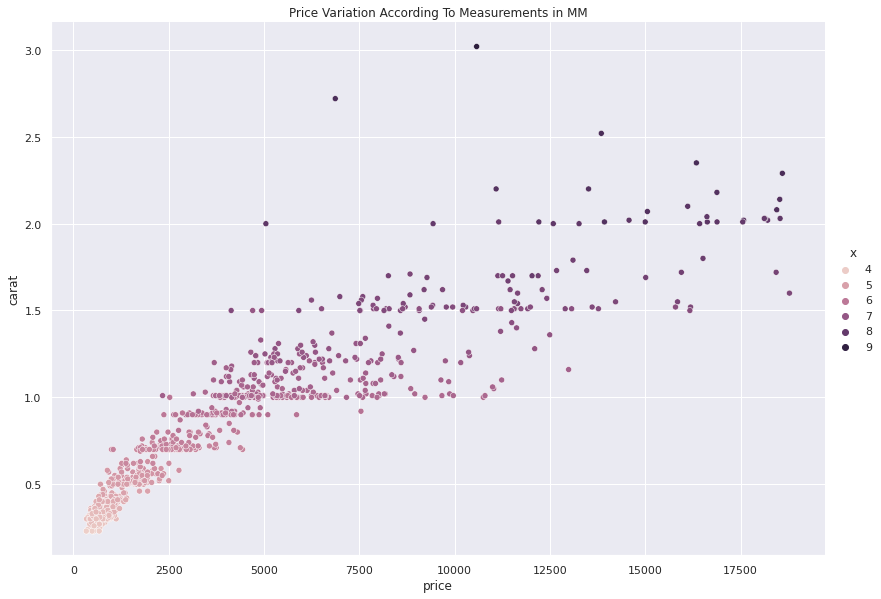
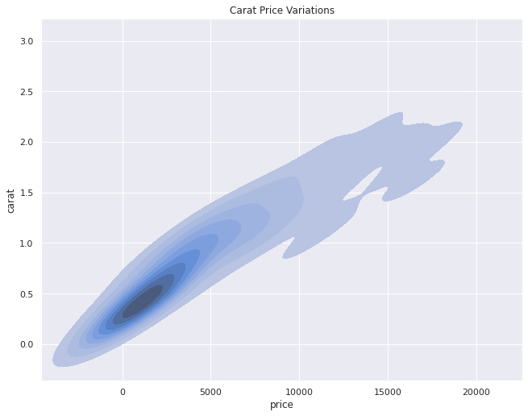

# Price Prediction

There are 53,940 diamonds in the dataset with 10 features (carat, cut, color, clarity, depth, table, price, x, y, and z). Most variables are numeric in nature, but the variables cut, color, and clarity are ordered factor variables. 

# An Overview of the Project

The project is split into 5 projects which show data cleaning, data visualization and machine learning models like Random Tree Regressor, Linear Regression and Decision Tree Regressor that were used to make predictions to the price.  

# Data Visualization
To get a better understanding of the data, I used the a scatter plot to see the relationship between the features. 

According to the scatter plot which sampled 1000 data points, the more the carats the higher the price of the diamonds. However there are some outliers where the carats were roughly high as 1.6 but were valued at 5500. There were also times when the carat was relatively low at 1.3 but was valued at 15,000USD.
The scatter plot also shows us the length(x) of the diamond which varies in color. As the length of the diamond grows the more expensive the diamond turned out to be. However there are some outliers where length was 8mm but the diamond price was roughly low at 7500 USD. While in some situations the diamond length was 6mm but the price was relatively high at 15,000 USD

According to the density graph above, the majority of the diamonds in our sample data have 0.2 to 0.8 carats as shown by the dark contours and these range between 300 and 2500 USD. The graph also shows that the higher the carats the more expensive the diamond.

# Summary of the Project

After cleaning and preprocessing the data, I made predictions to the price using regression models like Random Forest Regressor, Linear Regression and Decision Tree Regressor. After seeing the results of all the models, it was evident that the Random Forest Regressor out performed the rest with a 98% accuracy score on the test data. The model was also tuned to a max depth of 32 for it to score higher. 

The predicted price was added as to the data as a feature. 
