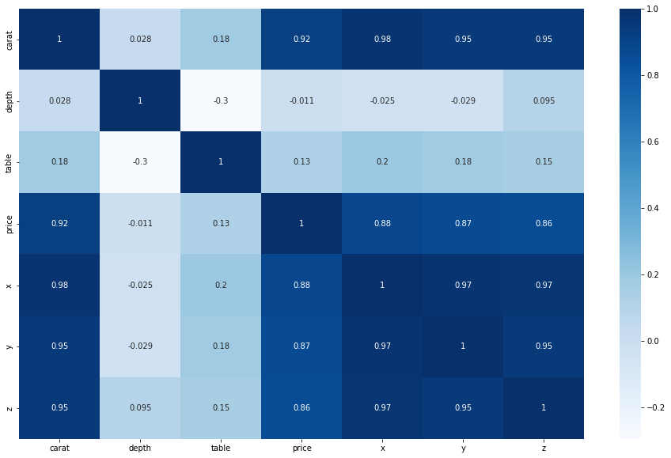

# Price Prediction

There are 53,940 diamonds in the dataset with 10 features (carat, cut, color, clarity, depth, table, price, x, y, and z). Most variables are numeric in nature, but the variables cut, color, and clarity are ordered factor variables. 

# An Overview of the Project

The project is split into 5 projects which show data cleaning, data visualization and machine learning models like Random Tree Regressor, Linear Regression and Decision Tree Regressor that were used to make predictions to the price.  

# Data Visualization
To get a better understanding of the data, I used the heat map visualization to see which features were highly correlated. 

There is a strong correlation between my target 'Price' and features like carat, x,y and z. This explains that these play a big factor in the price evaluation.

# Summary of the Project

After cleaning and preprocessing the data, I made predictions to the price using regression models like Random Forest Regressor, Linear Regression and Decision Tree Regressor. After seeing the results of all the models, it was evident that the Random Forest Regressor out performed the rest with a 98% accuracy score on the test data. The model was also tuned to a max depth of 32 for it to score higher. 

The predicted price was added as to the data as a feature. 
